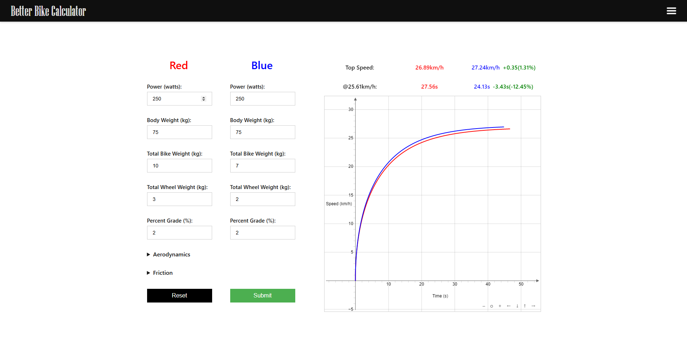

# Better Bike Calculator

## Acceleration Calculator

### Calculate and Visualize Acceleration Curves

* Tweak system parameters, aerodynamic factors, and friction parameters.
* Visualize the speed over time of the acceleration curves.
* Compare your setups.
* Hover the curves to get time at given speed.
* Calculate top speeds.

## Time Calculator

### Calculate and Visualize Acceleration for a Given Distance

* Tweak system parameters, route parameters, aerodynamic factors, and friction parameters.
* Visualize the speed over time of the acceleration curves.
* Compare your setups.
* Calculate top speeds and travel times.

## Upcoming Features

* Calculate power savings.
* Select power curves (riders typically initially accelerate with higher power).
* Export data.
* More mobile compatibility.

[Live Site](https://m-d-hoang.github.io/bike-calculator/#/)

